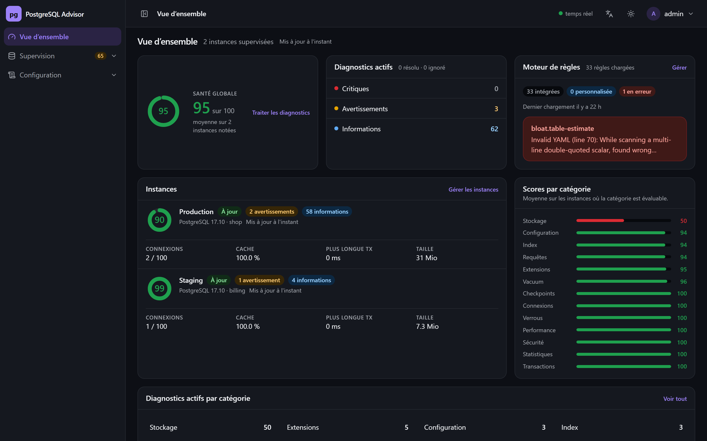
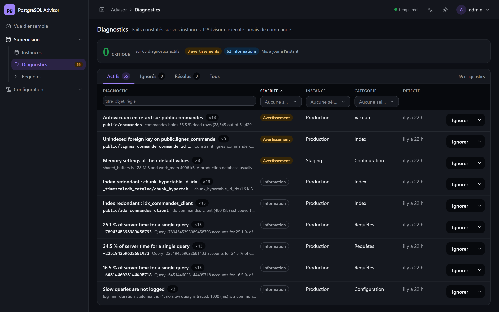
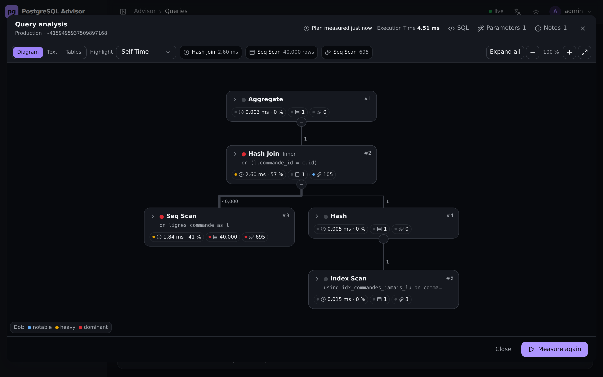

**Français** · [English](README.en.md)

# PostgreSQL Advisor

Advisor PostgreSQL self-hosted, livré comme un **unique conteneur Docker**. Une seule instance
supervise **plusieurs bases PostgreSQL distinctes**, en lecture seule, sans rien installer ni
modifier côté serveur (principe *zero-touch*), et produit un health score et des
diagnostics à partir d'un moteur de règles YAML rechargeable à chaud et **éditable depuis
l'interface**.

L'outil est utile sans aucune extension PostgreSQL et devient plus précis à mesure que
`pg_stat_statements`, `pgstattuple` ou HypoPG sont disponibles. TimescaleDB, lorsqu'elle est
présente, active en plus les règles qui lui sont propres.

## Aperçu

| Vue d'ensemble | Diagnostics |
| --- | --- |
| [](docs/APERCU.md#vue-densemble) | [](docs/APERCU.md#diagnostics) |

Le plan d'une requête se lit comme un diagramme d'activité : les données remontent des feuilles
vers la racine, l'épaisseur d'un lien donne les lignes remontées, et chaque compteur est coloré
selon son poids. Chaque étape se déplie sur place.

[](docs/APERCU.md#plan-dexécution)

→ [Toutes les captures](docs/APERCU.md) : requêtes multi-instances, valeurs de paramètres
proposées depuis la base, éditeur de règles, thème clair.

## Démarrage

```bash
docker compose up -d
```

L'interface est sur http://localhost:8080. Le mot de passe du compte `admin` est écrit **une
seule fois** dans les journaux du conteneur :

```bash
docker compose logs pg-advisor | grep "mot de passe"
```

Pour le fixer d'avance :

```bash
PGADVISOR_Auth__BootstrapPassword=... docker compose up -d
```

Puis : ajouter une instance → l'Advisor détecte ses capacités → les règles applicables
s'exécutent → health score et diagnostics, avec notification webhook des nouveaux
diagnostics.

## Rôle PostgreSQL à créer

L'Advisor n'a besoin que de lire. Un rôle de supervision suffit, et `pg_monitor` élargit ce
qu'il voit des autres sessions :

```sql
CREATE ROLE pg_advisor LOGIN PASSWORD 'change-moi';
GRANT pg_monitor TO pg_advisor;
GRANT CONNECT ON DATABASE ma_base TO pg_advisor;
```

Sans `pg_monitor`, l'Advisor fonctionne mais certaines règles sont automatiquement désactivées
et signalées comme telles dans l'interface. Aucune écriture n'est jamais tentée : la session
est ouverte avec `default_transaction_read_only=on` et un `statement_timeout` borné.

## Structure

```
pg-advisor
├── src/PgAdvisor.Api        ASP.NET Core 10 — API REST, SSE, rule engine, scheduler
│   ├── Auth/ Security/      cookie, hash PBKDF2, chiffrement des secrets au repos
│   ├── Collectors/          collecte read-only de l'activité et des statistiques
│   ├── Postgres/            connexions Npgsql, détection des capacités
│   ├── Rules/               modèle YAML, validation, expressions, gabarits, hot reload
│   ├── Scheduler/           BackgroundService, analyse par instance, garde-fou de coût
│   ├── Findings/            cycle de vie des findings, health score
│   ├── Notifications/       file d'attente et dispatcher webhook
│   └── Sse/                 bus d'événements temps réel
├── src/PgAdvisor.AppHost    Aspire — orchestration de la stack de développement
├── src/pg-advisor-web       React + TypeScript + Vite + Tailwind, compilé vers wwwroot
├── tests/PgAdvisor.Tests    tests du moteur de règles et du cycle des findings
├── rules                    règles YAML intégrées
├── scripts                  jeu de données de test et validation de bout en bout
├── docs                     descriptif projet et format des règles
├── Dockerfile               build multi-étapes SPA + API, image unique
├── docker-compose.yml       déploiement minimal
└── docker-compose.test.yml  deux PostgreSQL de test + récepteur de webhooks
```

## Développement

La stack de développement est orchestrée par [Aspire](https://aka.ms/dotnet/aspire) : une seule
commande démarre l'API, le serveur Vite, les deux PostgreSQL supervisés et le récepteur de
webhooks, et le tableau de bord Aspire réunit leurs journaux, leurs adresses et leur état.

```bash
dotnet run --project src/PgAdvisor.AppHost
```

| Ressource | Rôle | Adresse |
| --- | --- | --- |
| `web` | SPA servi par Vite, avec proxy vers l'API | http://localhost:5173 |
| `api` | API ASP.NET Core | http://localhost:5153 |
| `pg-full` | PostgreSQL 17 + TimescaleDB + `pg_stat_statements`, base `shop` | localhost:55432 |
| `pg-bare` | PostgreSQL 17 nu, base `billing` | localhost:55433 |
| `webhook-echo` | Récepteur de webhooks | http://localhost:58888 |

Le compte `admin` est créé au premier démarrage avec le mot de passe `advisor-dev` ; les deux
instances s'enregistrent avec l'utilisateur `postgres` et le mot de passe `advisor-test`.
`pg-full` est amorcée au démarrage avec
[`scripts/seed-test-data.sql`](scripts/seed-test-data.sql) : les règles ont de quoi réagir dès la
première analyse. Aucun volume n'est monté sur les instances de test, chaque démarrage repart donc
d'un état connu.

Les deux projets se lancent aussi séparément, sans Aspire :

```bash
dotnet run --project src/PgAdvisor.Api
```

```bash
npm --prefix src/pg-advisor-web run dev
```

Le serveur de développement Vite écoute alors sur http://localhost:5173 et relaie `/api` et
`/events` vers l'API sur le port de son profil de lancement, surchargeable par `PGADVISOR_API_URL`.
En production, le SPA est compilé dans `src/PgAdvisor.Api/wwwroot` et servi par ASP.NET Core.

```bash
dotnet test
```

### Validation de bout en bout

Cette validation porte sur l'image publiée et non sur le code en cours d'édition : elle passe donc
par Docker Compose plutôt que par Aspire. Les instances de test s'y démarrent séparément :

```bash
docker compose -f docker-compose.test.yml up -d
```

Le script suivant construit l'image, démarre le conteneur, alimente l'instance de test avec un
jeu de données qui déclenche des règles, enregistre les deux instances, attend la première
analyse, puis affiche capacités détectées, health score, diagnostics, notifications et le
résultat de chaque règle exécutée à blanc :

```bash
pwsh ./scripts/validate-e2e.ps1
```

Il vérifie aussi le principe zero-touch en listant, côté PostgreSQL, les extensions et les
paramètres après le passage de l'Advisor.

## Configuration

Toutes les clés se surchargent par variable d'environnement, préfixe `PGADVISOR_`, `__` pour
la hiérarchie. Les deux premières lignes échappent à ce préfixe : elles ne configurent pas
l'application mais l'endroit où on l'atteint.

```bash
PGADVISOR_PORT=9090 docker compose up -d
```

Sur un hébergeur qui impose son port et ne laisse pas publier le vôtre, c'est le port d'écoute
interne qu'il faut déplacer — `ASPNETCORE_HTTP_PORTS=9090`, ou `PORT` recopié dedans si la
plateforme n'expose que celui-là.

| Clé | Rôle | Défaut |
| --- | --- | --- |
| `PGADVISOR_PORT` | Port publié sur l'hôte par `docker-compose.yml` | `8080` |
| `ASPNETCORE_HTTP_PORTS` | Port d'écoute **dans** le conteneur, pour un hébergeur qui l'impose | `8080` |
| `DataDirectory` | Volume inscriptible : SQLite, clés, règles créées depuis l'IHM | `/app/data` en conteneur |
| `RulesDirectory` | Règles intégrées, montables en lecture seule | `/app/rules` en conteneur |
| `Auth__BootstrapPassword` | Mot de passe du compte `admin` créé au premier démarrage | généré et journalisé une fois |
| `Auth__RequireHttps` | Force l'attribut `Secure` sur le cookie | `false` |
| `Auth__SlidingExpirationHours` | Durée de validité de la session | `12` |
| `Scheduler__Intervals__Health` | Périodicité activité et connexions | `00:00:10` |
| `Scheduler__Intervals__Statistics` | Périodicité des statistiques | `00:01:00` |
| `Scheduler__Intervals__Recommendations` | Périodicité des analyses | `00:05:00` |
| `Scheduler__Intervals__Configuration` | Périodicité configuration et stockage | `01:00:00` |
| `Scheduler__MaxConcurrentInstances` | Instances analysées en parallèle | `4` |
| `Scheduler__PerInstanceTimeout` | Délai maximal par instance | `00:02:00` |
| `Scheduler__QueryTimeout` | `statement_timeout` appliqué aux règles sans timeout propre | `00:00:30` |
| `Scheduler__RuleGuard__Enabled` | Garde-fou de coût des règles | `true` |
| `Scheduler__RuleGuard__WarningThreshold` | Incidents consécutifs avant avertissement | `3` |
| `Scheduler__RuleGuard__QuarantineThreshold` | Incidents consécutifs avant mise en quarantaine | `5` |
| `Scheduler__RuleGuard__QuarantineDuration` | Durée d'une quarantaine avant réessai automatique | `06:00:00` |
| `Scheduler__RuleGuard__SlowRunRatio` | Part du timeout au-delà de laquelle un succès compte comme incident | `0.8` |
| `Notifications__MaxRetries` | Tentatives d'envoi d'un webhook | `3` |

Activer `Auth__RequireHttps` dès que l'Advisor est exposé derrière un reverse proxy en HTTPS.

## Ce que contient le volume de données

```
/app/data
├── pg-advisor.db      état de l'Advisor : comptes, connexions, findings, historique
├── keys/              clé de chiffrement des secrets et clés de protection des cookies
└── rules/             règles créées ou modifiées depuis l'IHM
```

Les mots de passe des instances supervisées sont chiffrés en AES-GCM avec une clé stockée hors
de la base, et ne sont jamais renvoyés par l'API ni écrits dans les journaux.

## Documentation

Chaque document existe dans les deux langues.

- [Aperçu de l'interface](docs/APERCU.md) — captures commentées de chaque vue
  ([English](docs/OVERVIEW.md))
- [Descriptif du projet](docs/PROJECT.md) — périmètre, architecture, priorités du MVP
  ([English](docs/PROJECT.en.md))
- [Format des règles](docs/RULES.md) — champs, prérequis, expressions, filtres, handlers,
  garde-fou de coût, API
  ([English](docs/RULES.en.md))
