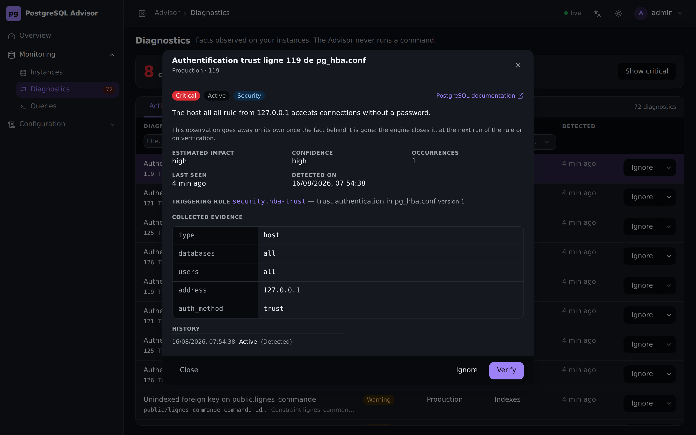
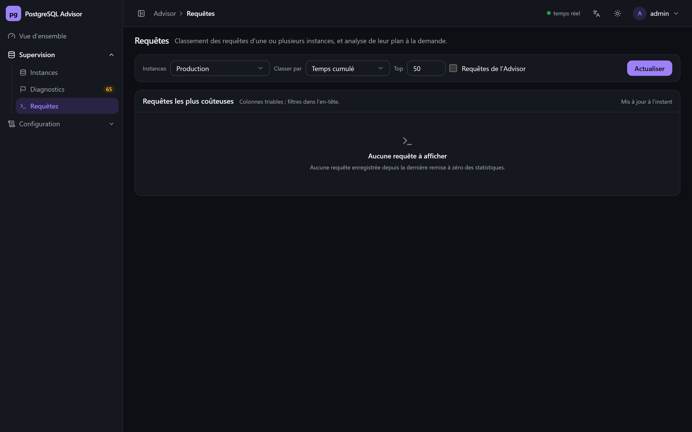
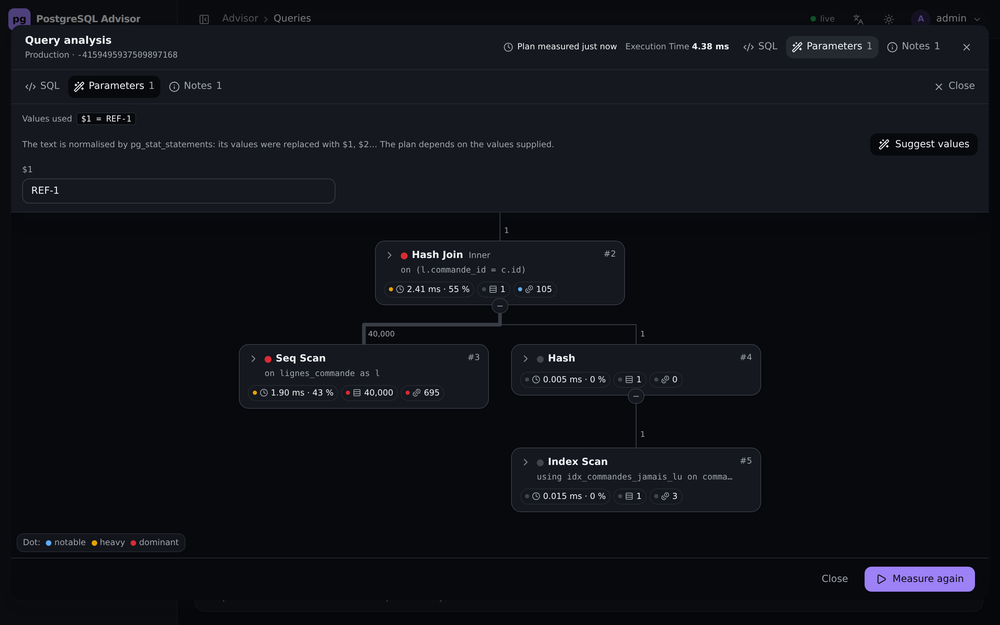
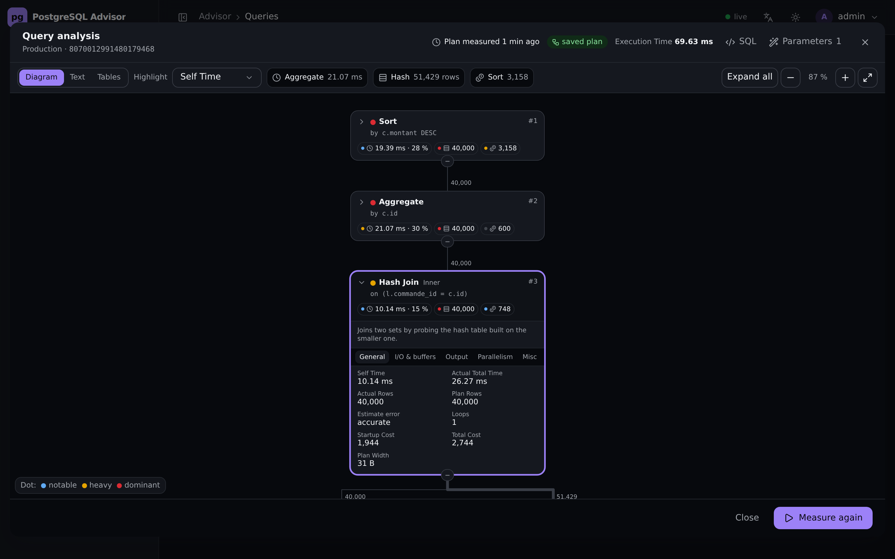
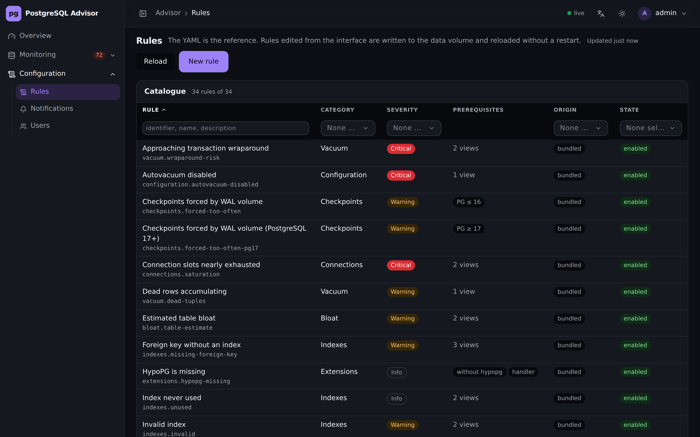
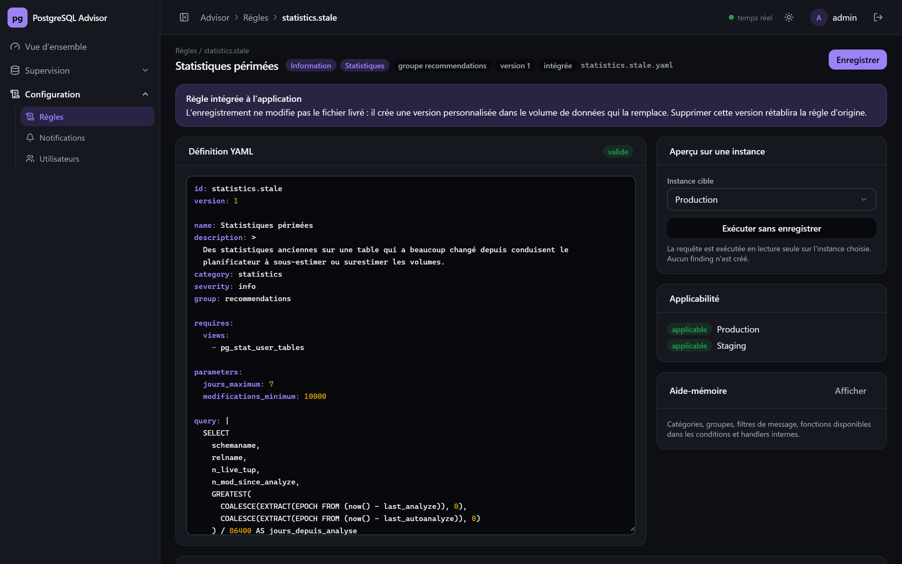
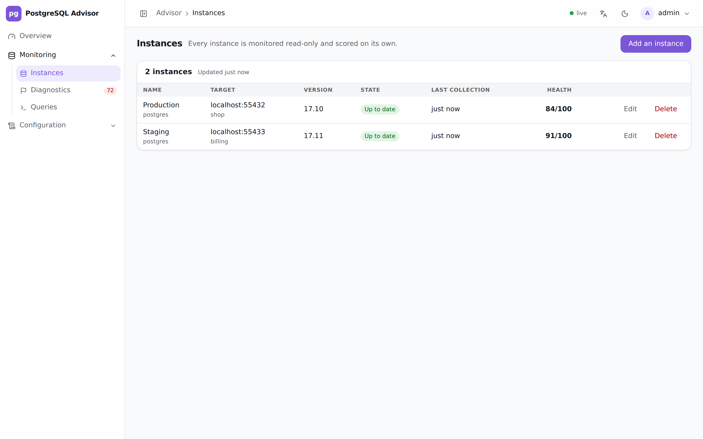

**Français** · [English](OVERVIEW.md)

# Aperçu de l'interface

Captures prises sur le jeu de test du dépôt : deux instances supervisées — une PostgreSQL 17
avec TimescaleDB et `pg_stat_statements`, une autre sans — alimentées par
[`scripts/seed-test-data.sql`](../scripts/seed-test-data.sql). Les chiffres sont donc ceux d'une
base réelle, pas d'une maquette.

## Vue d'ensemble

Santé globale, répartition des diagnostics par sévérité, score par catégorie et état de
chaque instance. Le tout se met à jour sans rechargement, par flux SSE.

## Diagnostics

Chaque diagnostic porte sa sévérité, son objet, la règle qui l'a produit et sa date de
détection. Un diagnostic ne se coche pas : il décrit un fait constaté sur l'instance, et sa
résolution appartient au moteur. Une ligne s'ignore ou se reconsidère, et se vérifie à la
demande — la vérification rejoue la règle sur l'instance et clôt le diagnostic si le problème
a disparu.

Le détail donne les mesures qui ont déclenché la règle, l'impact estimé, la confiance et, quand
elle existe, la commande SQL corrective.

## Requêtes

Classement des requêtes les plus coûteuses, d'**une ou plusieurs instances à la fois** : les
classements sont fusionnés sur le même critère et chaque ligne rappelle sa base d'origine. Les
colonnes sont triables et filtrables ; les requêtes de l'Advisor lui-même sont écartées par
défaut, puisqu'elles parlent de la supervision et non de l'application supervisée.

Une requête issue de `pg_stat_statements` est normalisée : ses valeurs sont remplacées par
`$1`, `$2`… Le bouton « Proposer des valeurs » les reconstitue à partir de la base — valeur la
plus fréquente connue du planificateur, à défaut une valeur existante — car un plan obtenu sur
une valeur courante ressemble à celui de la production.

## Plan d'exécution

Le plan est dessiné comme un diagramme d'activité : les données remontent des feuilles vers la
racine, l'épaisseur d'un connecteur et le nombre qui l'accompagne donnent les lignes remontées,
et chaque compteur est coloré selon son poids. Les raccourcis en haut mènent directement au
nœud le plus lent, au plus gros et au plus coûteux.

Chaque étape se déplie sur place : ce que fait le type de nœud, les avertissements le
concernant, puis le détail réparti en onglets — général, entrées/sorties et tampons, sortie,
parallélisme, divers.

## Règles

Les 34 règles livrées sont éditables depuis l'interface, comme celles que vous ajoutez. Le
moteur les recharge à chaud.

L'éditeur colore le YAML, valide la définition à la frappe et permet de l'exécuter à blanc sur
une instance : la requête part en lecture seule et aucun diagnostic n'est créé.

## Instances

Enregistrement d'une connexion, capacités détectées et état de collecte. L'interface suit le
thème du système, et se force en clair ou en sombre.

